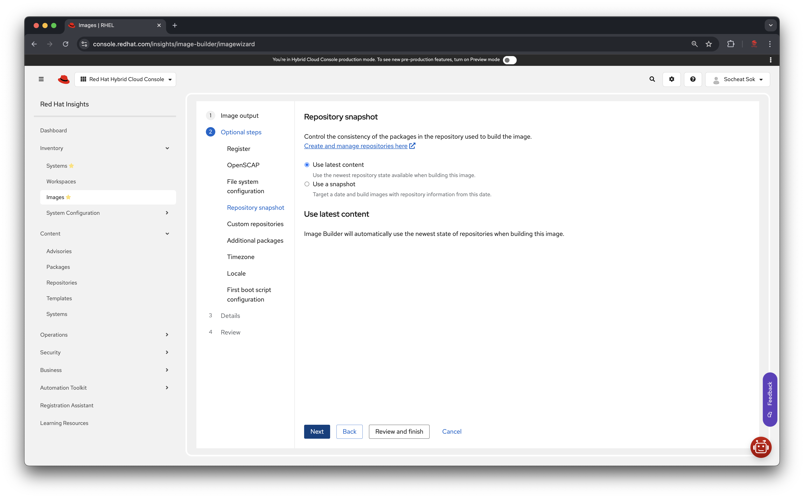
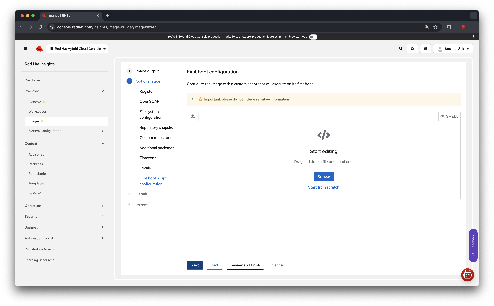
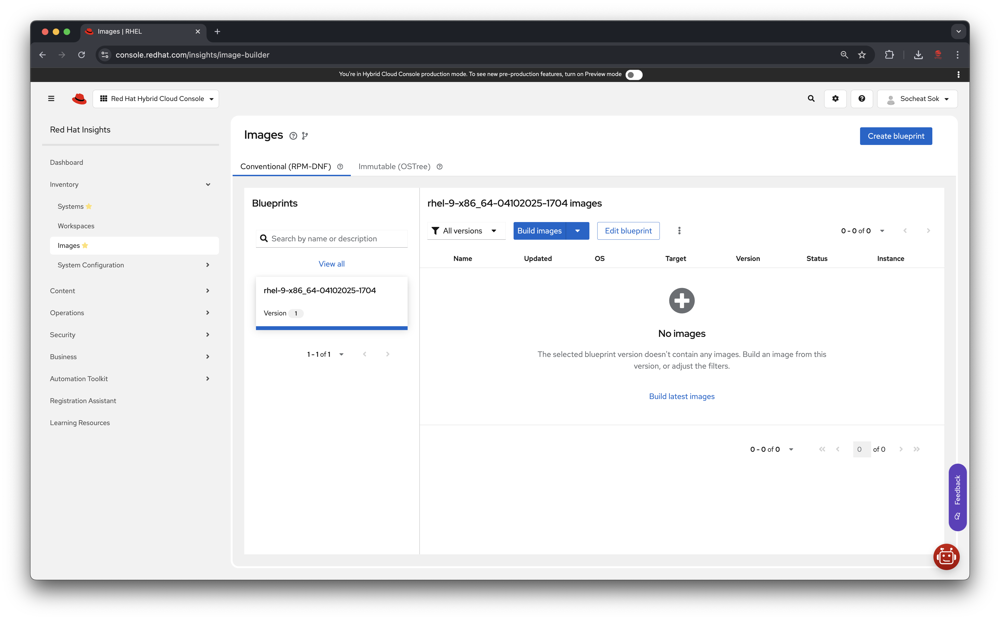

# Red Hat Enterprise Linux (RHEL)

To obtain the latest RHEL Cloud Images, you need the following:
- Red Hat account
- Access to Red Hat Cloud Console
- Access to Image Builder tool
- Blueprints for the images you want to create

> [!NOTE]
> Please follow the instructions below to navigate the **Red Hat Cloud Console** and create a cloud image for **RHEL**. In this example we will generate and image for **RHEL 9** with the latest updates to deploy on **VMWare vSphere&& environment.

**Table of contents**:
- [Red Hat Enterprise Linux (RHEL)](#red-hat-enterprise-linux-rhel)
  - [Navigating the Red Hat Cloud Console](#navigating-the-red-hat-cloud-console)
  - [Using the Image Builder tool](#using-the-image-builder-tool)
    - [1. Create a blueprint](#1-create-a-blueprint)
      - [Step 1: Image output](#step-1-image-output)
      - [Step 2: Optional steps](#step-2-optional-steps)
        - [1. Register your system to Red Hat](#1-register-your-system-to-red-hat)
        - [2. OpenSCAP](#2-openscap)
        - [3. File system configuration](#3-file-system-configuration)
        - [4. Repository snapshot](#4-repository-snapshot)
        - [5. Custom repositories](#5-custom-repositories)
        - [6. Additional packages](#6-additional-packages)
        - [7. Timezone](#7-timezone)
        - [8. Locale](#8-locale)
        - [9. First boot script configuration](#9-first-boot-script-configuration)
      - [Step 2. Details](#step-2-details)
      - [Step 3. Review](#step-3-review)
    - [2. Building images](#2-building-images)
    - [3. Managing images](#3-managing-images)

## Navigating the Red Hat Cloud Console

1. Go to the [Red Hat Cloud Console](https://console.redhat.com/).
2. Log in with your Red Hat account. (***If you do not have an account, please create one.***)

3. On the top left corner, click on the "**Red Hat Hybrid Cloud Console**" icon.

5. In the left navigation pane, click on "**Deploy**" and then select "**Images**".

6. You will be ditected to the "**Image Builder**" tool page.

## Using the Image Builder tool

The **Image Builder** tool allows you to create custom images for various platforms, including VMWare vSphere. You can use the provided blueprints or create your own.

Here are necessary steps to create an image:
1. Create a blueprint
2. Build images
3. Download images to your local machine or upload them to your cloud provider
4. Deploy the images to your desired environment

### 1. Create a blueprint

In the "**Image Builder**" tool, you can create a blueprint for your image. A blueprint is a set of instructions that defines how the image should be built. You can use the provided blueprints or create your own.

Click on the "**Create blueprint**" button at the top right corner of the page.

#### Step 1: Image output

In the "**Image output**" section, select the image type you want to create. In this example, we will create a **VMWare vSphere** image.

1. Choose the "**Release**" you want to use. In this example, we will use **RHEL 9**.
2. Choose the "**Architecture**" you want to use. In this example, we will use **x86_64**.
3. Select target environments. In this example, we will use **VMWare vSphere**.

Check the "**VMWare vSphere**" option and choose the "**Open virtualization format (.ova)**".

#### Step 2: Optional steps

> [!NOTE]
> You can skip this step by clicking on the "Review and finish" botton at the bottom of the page.

The optional steps includes:
1. Register your system to Red Hat
2. OpenSCAP
3. File system configuration
4. Repository snapshot
5. Custom repositories
6. Additional packages
7. Timezone
8. Locale
9. First boot script configuration

##### 1. Register your system to Red Hat

You can either automatically register your systems with **Red Hat** to enhance security and track your spending or choose to register your system during initial boot.

The "**Activation key**" will be automatically generated for you. You can use this key to register your system with Red Hat or you can manually create and manage the activation key in the "[Activation Keys page]"

##### 2. OpenSCAP

OpenSCAP enables you to automatically monitor the adherence of your registered RHEL systems to a selected regulatory compliance profile.

##### 3. File system configuration

Define the partitioning of the image

**Use automatic partitioning** (recommended):  
The system automatically partitions your image storage depending on the target environment(s). The target environment sometimes dictates all or part of the partitioning scheme. Automatic partitioning applies the most current supported configuration layout.

**Manually configure partitions**:  
Create partitions for your image by defining mount points and minimum sizes. Image builder creates partitions with a logical volume (LVM) device type.

##### 4. Repository snapshot
Control the consistency of the packages in the repository used to build the image.

By default, Image Builder will automatically use the newest state of repositories when building this image.

##### 5. Custom repositories

Select the linked custom repositories from which you can add packages to the image.

> [!NOTE]
> Repositories can be added in the "Repositories" area of the console. Once added, refresh this page to see them.
>
> You can add custom repositories following this guide [here](./custom_repositories.md).

##### 6. Additional packages

Blueprints created with Images include all required packages.

##### 7. Timezone

Select a timezone and NTP servers for the image.

##### 8. Locale

Select language and keyboard layout for the image.

##### 9. First boot script configuration
Configure the image with a custom script that will execute on its first boot.

> ![Important]
> Please do not include sensitive information.
>
> Please ensure that your script does not contain any secrets, passwords, or other sensitive data. All scripts should be crafted without including confidential information to maintain security and privacy.

#### Step 2. Details

In the "**Details**" section, you can provide a name and description for your image.

#### Step 3. Review

The "**Review**" section allows you to review the settings you have selected for your image. You can go back and make changes if needed.

Once you are satisfied with your selections, click on the "**Create blueprint**" button at the bottom of the page.

Alternatively, you can click on the "**Create blueprint and build image(s)**" button to create the blueprint and start building the image immediately.

### 2. Building images

Once you have created a blueprint, you can build images based on that blueprint.

To build an image, select the blueprint you want to use and click on the "**Build image**" button at the top right corner of the page.

**Example**: `rhel-9-x86_64-04102025-1704` blueprint

### 3. Managing images

You can manage your images in the "**Image Builder**" tool. You can view the status of your images, download them, or upload them to your cloud provider.

<!-- Links -->
[Activation Keys page]: https://console.redhat.com/insights/connector/activation-keys
