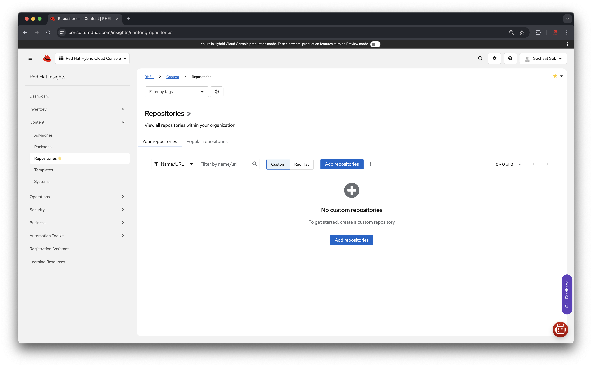
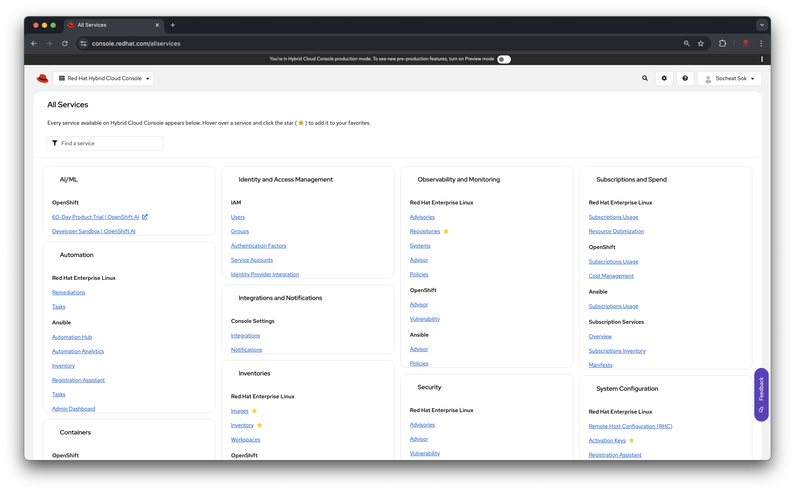
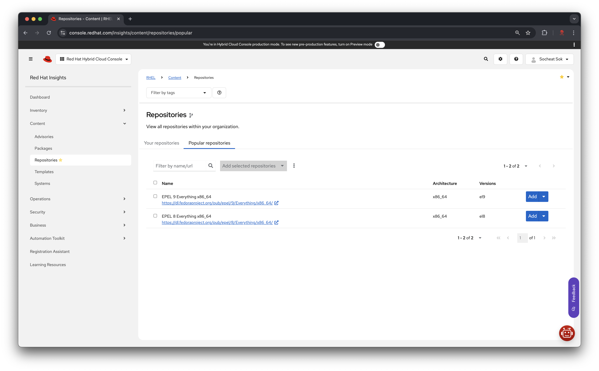
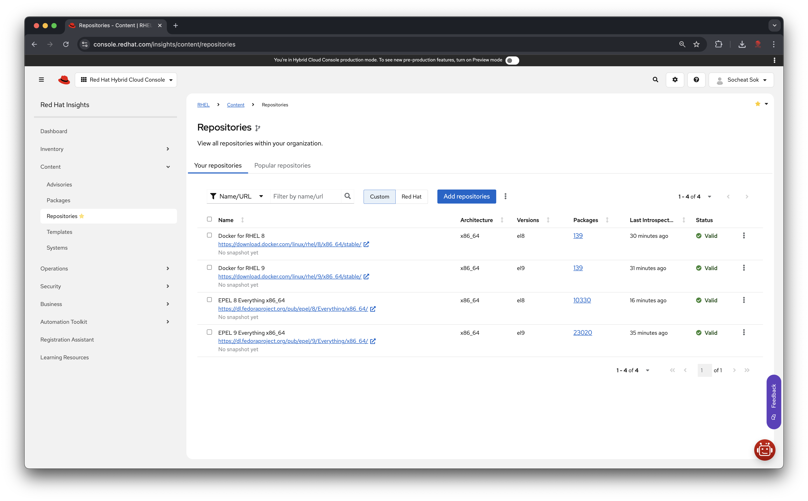
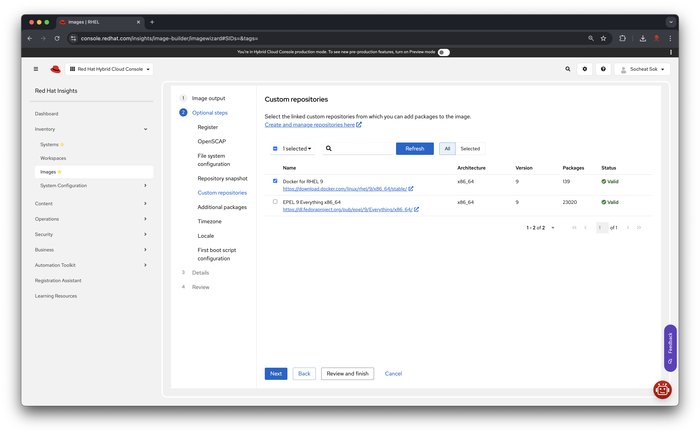
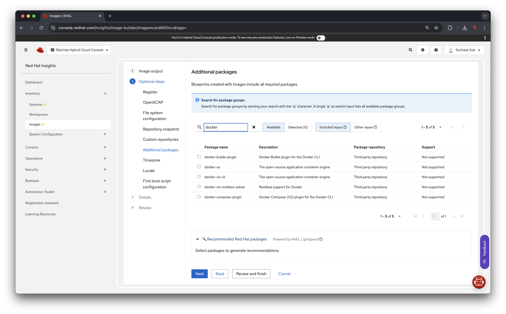
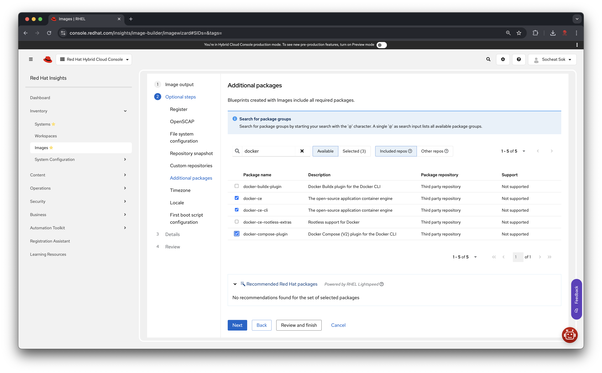

# RHEL Custom Repositories

View all repositories within your organization.

**Table of contents**:
- [RHEL Custom Repositories](#rhel-custom-repositories)
  - [Essential custom repositories](#essential-custom-repositories)
  - [Adding EPEL repository](#adding-epel-repository)
  - [Using custom repositories with Image Builder](#using-custom-repositories-with-image-builder)

## Essential custom repositories
Here are some essential custom repositories that you might want to add to your RHEL system:

- [Fedora EPEL](https://fedoraproject.org/wiki/EPEL) - Extra Packages for Enterprise Linux
- [Docker CE](./docker-ce.md)

> [!NOTE]
> Please note that the repositories listed here are not exhaustive. You can add any repository that you need for your specific use case.

## Adding EPEL repository

To add the EPEL repository, please follow the steps below:

1. In the "**Red Hat Hybrid Cloud Console**", click on "View all services" and locate "Repositores" under the "Observability and Monitoring" section.

2. In the "**Repositories**" page, you will see a list of all repositories within your organization. (if you have any)

3. Click on the "Popular repositories" tab.

4. In the "**Popular repositories**" tab, you will see a list of popular repositories, including the EPEL repository.
5. Select the repository you want to add and click on the "Add" button.

6. Navigate to "**Your repositories**" tab to see the added repository.

## Using custom repositories with Image Builder

In the "Custom repositores" step you can select the repositories you want to use for your image.

Once added, you will be able to search and add packages from the custom repositories in the "Additional packages" step.

Select the packages you want to add to your image.

